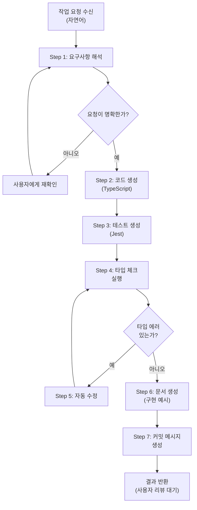

# Developer Agent 에이전트 시스템 설계서

> 작성일: 2026-09-19
> 목적: Claude Code 구현 참조용 계획서
> 단계: v0.1 (AI Agent Platform 핵심 에이전트)

---

## 1. 작업 컨텍스트

### 배경 및 목적

AI Agent Platform v0.1의 핵심 에이전트인 **Developer Agent**는 자연어 작업 요청을 받아 실행 가능한 TypeScript 코드, 테스트, 구현 문서를 생성합니다.

**문제 해결**:
- 개발팀이 반복적인 코드 작성/리뷰/테스트 작업을 자동화
- 설계 → 구현 → 검증의 전체 사이클을 단일 에이전트로 지원
- v0.1 완성으로 멀티 에이전트 플랫폼의 기초 검증

### 범위

**포함**:
- 자연어 작업 요청 수신 및 해석
- TypeScript 코드 생성 (재사용 가능한 구조)
- Jest 테스트 자동 생성 (기본 커버리지)
- 타입 체크 자동 실행 (`tsc`)
- 구현 문서 생성 (README/구현 예시)
- Git 커밋 자동 생성 (사용자 add 후)
- 코드 리뷰 및 개선 제안

**제외**:
- 배포/프로덕션 반영 (CI/CD 연동은 v0.2+)
- 자동 마이지레이션 스크립트
- 종속성 자동 업데이트
- UI/Frontend 코드 생성 (현재는 TypeScript/Node.js만)

### 입출력 정의

| 항목 | 내용 |
|------|------|
| **입력** | 자연어 작업 요청 (Claude Code 채팅창 또는 CLI 호출) |
| **출력** | (1) 실행 가능한 TypeScript 코드, (2) Jest 테스트, (3) 구현 문서, (4) Git 커밋 |
| **트리거** | 사용자 요청 또는 CLI: `claude --agent developer --task "작업 요청"` |
| **저장 위치** | `src/` 아래 프로젝트 구조에 따라 자동 생성. 사용자 검토 후 사용자가 `git add` 실행 |

### 제약조건

- **API 한도**: Anthropic API 사용 (하루 요청 한도 확인 필수)
- **타입 체크**: TypeScript strict mode (`tsconfig.json` 기준)
- **테스트**: Jest 커버리지 최소 80% (v0.1 기준)
- **문서화**: JSDoc/TSDoc 필수 (export function/class)
- **Git**: 이미 초기화된 저장소 가정 (`.git/` 존재)
- **응답 시간**: 코드 생성 3-5초, 테스트 생성 2-3초 목표 (큰 기능은 제외)

### 용어 정의

| 용어 | 정의 |
|------|------|
| **생성 코드** | Developer Agent가 작성한 TypeScript 코드 |
| **타입 체크** | `npm run build` (TypeScript 컴파일) |
| **테스트** | `npm test` (Jest 실행) |
| **구현 문서** | 생성된 코드의 사용법, 주요 함수/클래스 설명 |
| **Git 커밋** | 사용자가 add한 파일에 대한 자동 커밋 메시지 생성 |

---

## 2. 워크플로우 정의

### 전체 흐름도



### LLM 판단 vs 코드 처리 구분

| LLM이 직접 수행 | 스크립트로 처리 |
|----------------|----------------|
| 요구사항 해석 및 명확화 | TypeScript 타입 체크 (`tsc`) |
| 코드 구조/설계 판단 | Jest 테스트 실행 (`npm test`) |
| 코드 품질 평가 | 파일 생성/저장 |
| 테스트 케이스 설계 | Git 상태 확인 (staged files) |
| 문서화 내용 작성 | 커밋 실행 |
| 에러 분석 및 수정 방안 수립 | 코드 포맷팅 (`prettier` - 옵션) |

### 단계별 상세

#### Step 1: 요구사항 해석

- **처리 주체**: Developer Agent (LLM)
- **입력**: 사용자의 자연어 작업 요청
- **처리 내용**: 
  - 요청의 목적, 범위, 제약 조건 파악
  - 필요한 파일 위치, 모듈 구조 결정
  - 불명확한 부분 재질문
- **출력**: 정규화된 요구사항 (내부 상태)
- **성공 기준**: 요청이 다음 단계에서 구현 가능한 수준으로 명확해짐
- **검증 방법**: LLM 자기 검증 ("이 요구사항이 충분히 구체적인가?")
- **실패 시 처리**: 사용자에게 추가 정보 요청 (재질문)

#### Step 2: 코드 생성 (하이브리드 구조)

Step 2는 LLM 직접 생성 대신 **3단계 하이브리드 구조**를 사용합니다:

**Step 2-1: Request-Spec 생성 (LLM)**
- 입력: Step 1의 정규화된 요구사항
- 처리: 자연어 → 구조화된 JSON 명세로 변환 (플랫폼팀이 사전 정의한 스키마 준수)
- 출력: request-spec (미확정 항목 포함, 질문 필요한 부분 명시)
- 주요 요소: 기능 설명, 파라미터, 제약사항, 미확정 사항, 기본정책 적용 근거

**Step 2-2: Repository Context 수집 (스크립트)**
- 입력: 현재 프로젝트 저장소
- 처리: 기술스택, 폴더 구조, 기존 템플릿 목록, 코딩 규칙 수집
- 출력: repository-context (구조화된 JSON)

**Step 2-3: Execution Plan 결정 (규칙 기반 라우터 - scripts/router.ts)**
- 처리 주체: 규칙 기반 라우터 (TypeScript, `scripts/router.ts`)
- 입력: request-spec (JSON) + repository-context (JSON)
- 처리: 
  - 템플릿 레지스트리 (`contracts/patterns/`) 조회
  - 요청과 매칭 가능한 템플릿 판정
  - 템플릿 기반 vs 신규 로직 판정
  - 허용 변경 범위(파일/모듈/함수 수준) 결정
- 출력: execution-plan (JSON 파일 `output/execution-plan.json`)
  ```json
  {
    "approach": "template-based" | "custom-logic",
    "target_files": ["src/agents/developer.ts"],
    "allowed_scope": {
      "files": ["src/agents/developer.ts"],
      "max_depth": "function",
      "forbidden_changes": ["interface", "export signature"]
    },
    "commands": {
      "typeCheck": "npm run build",
      "test": "npm test"
    }
  }
  ```

**Step 2-4: 코드 생성 (템플릿 또는 LLM)**
- 처리 주체: 규칙 기반 생성기 또는 LLM (Developer Agent)
- 입력: execution-plan.json
- 처리: execution-plan의 결정에 따라:
  - **템플릿 기반**: 규칙 기반 생성기가 파라미터 조합으로 코드 생성 (정확도↑, 비용↓)
  - **Custom-logic**: LLM (Developer Agent)이 신규 로직 작성 (유연성↑, 검증 필요)
- 출력: TypeScript 파일을 `output/generated_code.ts`에 저장

- **성공 기준**: 문법적으로 올바른 TypeScript, 실행 논리가 명확함, execution-plan 준수
- **검증 방법**: TypeScript 문법 검증 (다음 단계인 타입 체크로 확인)
- **실패 시 처리**: 문법 오류 또는 execution-plan 위반 발견 시 Step 5에서 자동 수정

#### Step 3: 테스트 생성 (하이브리드 구조)

**Step 3-1: 결정론적 테스트 템플릿 우선**
- 처리 주체: 규칙 기반 생성기
- 입력: execution-plan.json, `output/generated_code.ts`
- 템플릿으로 생성할 테스트:
  - 초기 렌더링·로딩 상태
  - 성공/실패 케이스
  - 엣지 케이스 (중복, 타임아웃)
  - WebView Bridge 호출 검증
  - 에러 처리
- 출력: 기본 테스트 스켈레톤 (`output/generated_code.test.ts`)

**Step 3-2: 신규 로직 테스트는 LLM 보조**
- 처리 주체: Developer Agent (LLM) — 템플릿에 없는 케이스만
- 입력: 생성 코드 + 기본 테스트 + acceptance criteria
- 추가할 테스트: 새로운 게임 규칙, 복합 상태 전환, 누락된 경계조건
- 출력: 추가 테스트 코드 append to `output/generated_code.test.ts`

**Step 3 최종**:
- **성공 기준**: Jest 실행 가능 + 80% 커버리지 + 기대값 임의 완화 금지
- **검증 방법**: Jest 실행 시 테스트 통과 여부 (Step 4+)
- **실패 시 처리**: 테스트 실패 시 Step 5에서 자동 수정

#### Step 4: 타입 체크 실행

- **처리 주체**: 스크립트 (`npm run build`)
- **입력**: Step 2, 3의 코드 및 테스트 파일
- **처리 내용**:
  - TypeScript strict mode 컴파일
  - 타입 에러, 미사용 변수 검출
- **출력**: 컴파일 결과 (에러 목록 또는 성공)
- **성공 기준**: 0개의 타입 에러
- **검증 방법**: 컴파일 exit code (0 = 성공)
- **실패 시 처리**: 타입 에러 발견 시 Step 5로 진행

#### Step 5: 자동 수정 (제한적 범위)

- **처리 주체**: Developer Agent (LLM) — **execution-plan의 허용 범위 내에서만**
- **입력**: Step 4의 컴파일 에러 메시지 또는 Step 3의 테스트 실패 메시지
- **처리 내용**:
  - 에러 원인 분석
  - execution-plan이 지정한 범위 내에서만 코드 수정
  - 최대 3회 재시도

**권한 경계 (execution-plan에 명시)**:

**허용 범위**:
- 단순 함수/메서드 구현 수정 (내부 로직만)
- 기능 모듈 내부 구현 수정
- 기존 설치·승인된 모듈의 import 추가 가능
- 로컬 변수·상수 추가/수정
- 에러 처리 로직 추가

**금지 범위 (즉시 Architect 단계로 이관)**:
- ❌ 공개 인터페이스 변경 (export function/class 시그니처)
- ❌ API 계약·데이터 구조 변경 (기존 호출자에게 영향)
- ❌ WebView Bridge 호출 변경
- ❌ 전체 아키텍처 또는 폴더 구조 변경
- ❌ 새로운 모듈/패키지 의존성 추가 (사전 승인 필요)
- ❌ 기존 테스트 삭제 또는 기대값 완화
- ❌ execution-plan이 정의한 허용 범위 초과

**제한사항**:
- 최대 3회 자동 수정 시도
- **동일 오류 반복**: 2회 연속 같은 오류면 사람에게 이관
- **허용 범위 초과 감지**: 즉시 중단하고 사람에게 이관
- 자동 수정이 다른 테스트를 깨뜨리면 재분석 후 재시도

- **출력**: 수정된 코드/테스트 (범위 내, `output/generated_code.ts`, `output/generated_code.test.ts`에 덮어쓰기)
- **성공 기준**: 재수정된 코드가 Step 4 통과 또는 테스트 통과 + execution-plan 준수
- **검증 방법**: 컴파일 및 테스트 재실행 + 변경 범위 검증 (diff 확인)

**실패 시 처리**:

1. **동일 오류 반복 (2회 연속)**:
   - 재시도 횟수 증가 no, 사용자에게 이관
   - 반환 정보: 에러 로그, LLM 분석, 문제 지점, 수동 수정 제안
   - 사용자가 수정 후 새로운 요청으로 재개

2. **허용 범위 초과 감지**:
   - Step 5 중단, **Architect 단계로 이관**
   - 반환 정보: 어느 부분이 범위를 초과했는지, 왜 아키텍처 재설계가 필요한지, 현재 execution-plan과 충돌하는 부분
   - Architect가 새로운 아키텍처와 execution-plan을 제시 후 재개

3. **3회 재시도 모두 실패**:
   - Step 5 종료
   - 반환 정보: 
     - 시도 1~3의 에러 이력
     - 각 시도의 LLM 분석
     - 사용자가 고려할 수정 방안 제안
     - 코드, 테스트, 원래 요청 코컨텍스트 함께 제시
   - 사용자가 수동으로 코드 수정 후 Step 4 (타입 체크)부터 재개

#### Step 6: 문서 생성 (하이브리드 구조)

**Step 6-1: 결정론적 문서 (명세·코드에서 자동 추출)**
- 처리 주체: 규칙 기반 생성기
- 입력: execution-plan.json, `output/generated_code.ts`, 테스트 결과
- 자동 생성 문서:
  - API 명세 (함수 시그니처, 매개변수, 반환값)
  - 요구사항 추적표 (request-spec → 생성 코드 매핑)
  - 테스트 결과표
  - 변경 파일 목록
  - Dependency 목록
  - 버전/변경사항 summary
- 출력: 구조화된 Markdown 문서 템플릿 (`output/generated_docs.md`)

**Step 6-2: 자연어 설명은 LLM 작성**
- 처리 주체: Developer Agent (LLM)
- 입력: 생성 코드 + 결정론적 문서 템플릿
- LLM이 추가할 문서:
  - README 설명 (기능 요약, 사용법)
  - 복잡한 로직 설명
  - 설계 결정 근거
  - 운영자 안내
- **제약**: LLM은 새로운 사실(수치, API, 파일경로)을 추가하면 안 됨. 코드/테스트에서 가져온 데이터만 사용

**Step 6 최종**:
- **출력**: 최종 Markdown 문서 `output/generated_docs.md`
- **성공 기준**: 결정론적 섹션 + 설명 섹션 포함, 새로운 사실 없음
- **검증 방법**: LLM 자기 검증 ("이 문서가 코드와 테스트에 기반하나?")
- **실패 시 처리**: 문서 부족 시 재생성 (Step 6 재실행)

#### Step 7: 커밋 메시지 생성

- **처리 주체**: Developer Agent (LLM)
- **입력**: Step 2의 코드 변경사항, 작업 요청
- **처리 내용**:
  - Git 커밋 메시지 작성 (행동형, 상세)
  - 형식: `[Agent] 작업 요약\n\n상세 설명\n\nCo-Authored-By: ...`
- **출력**: 커밋 메시지 (텍스트)
- **성공 기준**: 메시지가 100자 이내의 주요 내용 + 상세 설명 포함
- **검증 방법**: 형식 검증 (첫 줄 < 72자, 빈 줄 구분 등)
- **실패 시 처리**: 형식 오류 시 자동 수정

#### Step 8: 결과 반환

- **처리 주체**: Developer Agent (협상)
- **입력**: Step 2-7의 모든 결과물
- **처리 내용**:
  - 코드, 테스트, 문서 함께 표시
  - 커밋 메시지 제시
  - 사용자 검토 요청
- **출력**: 최종 결과물 (코드, 테스트, 문서, 커밋 메시지)
- **성공 기준**: 모든 파일이 생성되고 사용자가 검토함
- **검증 방법**: 사용자 승인 (수동)
- **실패 시 처리**: 사용자 피드백 → Step 2 재시작

### 상태 전이

| 상태 | 전이 조건 | 다음 상태 |
|------|----------|----------|
| `요청 대기` | 사용자가 작업 요청 제출 | `요구사항 해석` |
| `요구사항 해석` | 요청이 명확해짐 | `코드 생성` |
| `요구사항 해석` | 불명확 | `사용자 재질문` (→ 요청 대기) |
| `코드 생성` | 코드 작성 완료 | `테스트 생성` |
| `테스트 생성` | 테스트 작성 완료 | `타입 체크` |
| `타입 체크` | 에러 없음 | `문서 생성` |
| `타입 체크` | 에러 발생 | `자동 수정` |
| `자동 수정` | 수정 완료 | `타입 체크` (재검사) |
| `자동 수정` | 3회 재시도 실패 | `에스컬레이션` (사용자 수동 개입) |
| `문서 생성` | 문서 작성 완료 | `커밋 메시지 생성` |
| `커밋 메시지 생성` | 메시지 작성 완료 | `결과 반환` |
| `결과 반환` | 사용자 승인 | `요청 대기` (다음 작업) |

---

## 3. 구현 스펙

### 폴더 구조

```
E:\ai-agent-platform/
├── CLAUDE.md                         # 메인 에이전트 지시 (Developer Agent 중심)
├── README.md
├── package.json
├── tsconfig.json
├── .env                              # Anthropic API 키
├── .env.example
├── .gitignore
├── git init                          # 이미 초기화됨
│
├── contracts/
│   └── patterns/
│       └── minigame_shell_v1.json    # Agent 계약서 스키마 (예시)
│
├── scripts/
│   ├── check-arch.ts                 # 아키텍처 검증 (기존)
│   ├── run-tests.ts                  # TEST 실행 스크립트 (NEW)
│   ├── type-check.ts                 # TypeScript 컴파일 (NEW)
│   ├── git-commit.ts                 # Git 커밋 자동화 (NEW)
│   └── dev-agent-runner.ts           # Developer Agent 진입점 (NEW)
│
├── src/
│   ├── index.ts                      # 진입점 (기존)
│   ├── orchestrator.ts               # Agent 조율 (기존)
│   │
│   └── agents/
│       ├── index.ts                  # 진입점 (기존)
│       ├── developer.ts              # Developer Agent (v0.1 구현)
│       │   - class DeveloperAgent
│       │   - execute(task, context)
│       │   - generateCode()
│       │   - generateTests()
│       │   - typeCheck()
│       │   - autoFix()
│       │   - generateDocs()
│       │   - generateCommitMessage()
│       │
│       ├── validator.ts              # Validator Agent (틀만 - v0.2+)
│       ├── optimizer.ts              # Optimizer Agent (틀만 - v0.2+)
│       └── ... (기타 6개 Agent, v0.2+)
│
├── output/                           # 생성된 코드 임시 저장 (NEW)
│   └── .gitkeep
│
└── docs/                             # 구현 문서 저장 (NEW)
    └── solutions/
        └── developer-agent/
            ├── implementation.md     # 실제 구현 예시
            └── examples.md           # 사용 예시
```

### 에이전트 구조

**선택 이유**: 단일 에이전트 (Developer Agent만)
- v0.1 목표가 Developer Agent 하나의 end-to-end 완성
- 워크플로우가 순차적 (Step 1 → 8)
- 전체 지시가 컨텍스트 윈도우의 30% 이내 예상
- 단계 간 맥락 공유 중요 (타입 에러 → 수정 → 재검사)

향후 Validator, Optimizer 등은 sub-agent로 분리 (v0.2+)

### 주요 구현 파일

#### 1. `src/agents/developer.ts`

**책임**:
- LLM 호출 총괄 (Anthropic API)
- 8단계 워크플로우 오케스트레이션
- 상태 관리 (현재 단계, 생성된 코드/테스트/문서)

**핵심 메서드**:
```typescript
class DeveloperAgent {
  async execute(task: string, context?: string): Promise<DeveloperAgentResult>
  private async interpretRequirements(task: string)
  private async generateCode()
  private async generateTests()
  private async autoFix(errorLog: string, retryCount: number)
  private async generateDocs()
  private async generateCommitMessage()
}
```

#### 2. `scripts/type-check.ts`

**책임**:
- TypeScript 컴파일 실행 (`tsc`)
- 컴파일 에러 파싱 및 반환

**입출력**:
```typescript
async function typeCheck(
  files: string[]  // 체크할 .ts 파일 경로 배열
): Promise<{ errors: TypescriptError[]; success: boolean }>
```

#### 3. `scripts/run-tests.ts`

**책임**:
- Jest 테스트 실행 (`npm test`)
- 테스트 결과 파싱 (성공/실패, 커버리지)

**입출력**:
```typescript
async function runTests(): Promise<{ 
  passed: number; 
  failed: number; 
  coverage: number; 
  logs: string 
}>
```

#### 4. `scripts/git-commit.ts`

**책임**:
- Git staged files 확인
- 커밋 실행 (메시지 포함)

**입출력**:
```typescript
async function executeCommit(
  message: string,
  author?: string
): Promise<{ success: boolean; commitHash: string }>
```

#### 5. `scripts/dev-agent-runner.ts`

**책임**:
- CLI 진입점
- 사용자 요청 수신 및 Agent 호출

**사용법**:
```bash
tsx scripts/dev-agent-runner.ts "TypeScript에서 깊이 우선 탐색을 구현해줘"
```

#### 6. `CLAUDE.md` (Developer Agent 지시)

**섹션**:
1. 프로젝트 개요 (v0.1 목표)
2. Developer Agent 책임
3. 8단계 워크플로우 상세
4. 도구/API 사용법 (Anthropic API)
5. 실패 처리 및 에스컬레이션
6. 테스트 및 검증 기준

### 데이터 전달 패턴 (파일 기반)

모든 중간 결과물은 `output/` 아래 파일로 저장 (추적성 및 검증 용이):

| 단계 | 산출물 | 저장 경로 | 형식 |
|------|--------|----------|------|
| Step 1 | 정규화된 요구사항 | `output/request-spec.json` | JSON |
| Step 2-1 | Request-spec | `output/request-spec.json` | JSON |
| Step 2-2 | Repository-context | `output/repository-context.json` | JSON |
| Step 2-3 | Execution-plan | `output/execution-plan.json` | JSON |
| Step 2-4 | 생성된 코드 | `output/generated_code.ts` | TypeScript |
| Step 3 | 생성된 테스트 | `output/generated_code.test.ts` | TypeScript |
| Step 4 | 타입 체크 결과 | `output/type-check-result.json` | JSON (에러 목록) |
| Step 5 | 수정된 코드 | `output/generated_code.ts` (덮어쓰기) | TypeScript |
| Step 6 | 생성된 문서 | `output/generated_docs.md` | Markdown |
| Step 7 | 커밋 메시지 | 메모리 (상태 변수) | 텍스트 |
| Step 8 | 최종 결과 | `output/summary.json` | JSON |

**최종 결과물** (사용자 리뷰용):
```
✅ 코드:          output/generated_code.ts
✅ 테스트:        output/generated_code.test.ts
✅ 문서:          output/generated_docs.md
✅ 명세:          output/request-spec.json
✅ 실행계획:      output/execution-plan.json
✅ 커밋 메시지:   [메모리에서 전달, 사용자가 git add 후 실행]
```

**사용자 최종 워크플로우**:
```bash
# 1. Claude Code에서 Developer Agent 실행
# 2. output/ 폴더의 결과 검토
# 3. output/generated_code.ts를 실제 위치로 이동 (원하는 경로에 배치)
# 4. git add <배치된 파일>
# 5. Developer Agent가 커밋 메시지 제시
# 6. git commit -m "<Agent가 제시한 메시지>"
```

### CLAUDE.md 작성 원칙

Developer Agent 구현 시 적용할 4가지 핵심 원칙:

#### 원칙 1: 명확한 의도 우선 (Think Before Coding)

**내용**:
- 각 메서드/스크립트의 목적을 명시적으로 작성
- "왜 이 단계가 필요한가?"에 먼저 답하기
- 코드보다 주석으로 설계 의도 먼저 표현

**자기 검증**:
- [ ] 각 메서드의 docstring에 "목적", "입력", "출력", "부작용" 기술
- [ ] 복잡한 로직에는 "왜 이렇게 했는가?" 주석 포함
- [ ] Step별 경계가 명확한가? (예: typeCheck는 error만 반환, 수정은 autoFix의 책임)

#### 원칙 2: 최소 충분한 구현 (Simplicity First)

**내용**:
- 첫 번째 구현에서 모든 기능을 노리지 말 것
- v0.1은 기본 경로 (정상 케이스)에 집중
- 엣지 케이스는 이후 개선으로 미룬다

**자기 검증**:
- [ ] autoFix에서 3회 재시도만 지원 (무한 루프 방지)
- [ ] 테스트 생성 시 "반드시 필요한 테스트"만 포함 (모든 조합 제외)
- [ ] 문서는 API 설명 + 1-2개 예시만 (세부 튜토리얼 제외)

**트레이드오프**:
- 수용: "초기 구현이 완벽하지 않을 수 있음"
- 대신: "빠른 피드백 루프와 반복 개선"

**성공 지표**:
- 사용자가 생성된 코드를 "거의 수정 없이" 사용 가능
- Step 1 (요구사항 해석)부터 Step 7 (커밋 메시지)까지 평균 20초 이내

#### 원칙 3: 최소 변경 (Surgical Changes)

**내용**:
- 기존 프로젝트 구조(orchestrator.ts, package.json)를 최대한 유지
- 새 파일은 명확한 책임으로만 추가
- 기존 파일 수정은 꼭 필요할 때만

**자기 검증**:
- [ ] orchestrator.ts 수정 필요 없음 (Developer Agent는 독립적 실행 가능)
- [ ] package.json에 새 dependency 최소화 (tsx만 추가되면 충분)
- [ ] src/agents/developer.ts는 새 파일, 기존 validator.ts는 수정 안 함

#### 원칙 4: 목표 중심의 판단 (Goal-Driven Execution)

**내용**:
- 모든 기술 선택의 근거를 "v0.1 검증" 목표에 맞출 것
- "이게 v0.1 성공에 필수인가?"를 묻고 판단
- 흥미로운 기술이라도 목표와 무관하면 스킵

**자기 검증**:
- [ ] Anthropic API 외 다른 LLM API 사용 제외
- [ ] 복잡한 상태 머신(enum 기반) 제외 → 단순 string 상태로 충분
- [ ] 자동 배포 기능 제외 (v0.2+)

**트레이드오프**:
- 수용: "완벽함보다 검증 속도"
- 대신: "v0.2부터 기능 추가 가능한 기초 구축"

**성공 지표**:
- 구현 후 "/blueprint" → "/deep-dive" → 구현 → 검증의 한 사이클이 **1시간 이내**에 완료 가능

---

### 스킬 생성 규칙

Developer Agent 구현 중 다음 스킬들이 필요할 경우 **반드시 `skill-creator` 스킬을 사용해서 생성**해야 합니다. 직접 SKILL.md를 작성하는 것은 금지됩니다.

**예상되는 스킬 (v0.1)**:
1. **code-validator** - 생성된 코드 검증 (타입 체크, 린트 규칙)
2. **test-optimizer** - 테스트 커버리지 분석 및 개선 제안
3. **commit-analyzer** - Git 커밋 로그 분석 및 메시지 개선

**사용법**:
```bash
# Claude Code에서
/skill-creator "code-validator" "생성된 코드가 타입 체크와 린트를 통과하는지 검증"
/skill-creator "test-optimizer" "Jest 테스트 커버리지 분석 및 개선 제안"
/skill-creator "commit-analyzer" "Git 커밋 메시지 분석 및 개선"
```

각 스킬은 **참조 문서와 실행 스크립트**를 포함하며, Claude Code에서 자동으로 로드됩니다.

---

## 3.5 Deep-Dive 인터뷰에서 확인된 전제 (Phase 4)

다음 전제들이 이 설계의 성립 기반입니다:

1. **플랫폼팀이 v0.1 시점에 JSON Schema를 미리 정의하고 확정한다**
   - Request-spec, repository-context, execution-plan의 스키마는 Git에서 버전 관리
   - LLM은 스키마를 변경하지 않고, 기존 스키마에 맞춰 명세를 채움
   - 런타임에 스키마가 생성되거나 변경되지 않음

2. **템플릿 레지스트리는 Git에서 버전 관리되며, 변경은 PR·리뷰·테스트를 거친다**
   - `contracts/patterns/` 아래에 각 템플릿별 파라미터 스키마 정의
   - 템플릿 추가·수정은 사람의 코드 리뷰 필수
   - LLM을 이용한 스키마 초안 작성은 가능하지만, 자동 반영되지 않음

3. **Step 3 (테스트 생성), Step 6 (문서 생성)도 같은 하이브리드 구조를 따를 것이다**
   - 규칙 기반 템플릿 (기존 테스트·문서 구조)
   - 신규 로직은 LLM이 생성
   - 이후 Step 4·5의 검증을 통과해야 함

4. **Step 5 (자동 수정)의 범위가 execution-plan에 의해 제한된다**
   - LLM은 허용된 파일·모듈·함수만 수정 가능
   - 공개 인터페이스·API 계약·아키텍처 변경은 즉시 Architect 단계로 이관
   - 이 경계가 명확하지 않으면 설계 재협의 필요

**검증**: 이 전제들이 깨질 신호
- 플랫폼팀이 스키마 정의를 미루거나 불명확하게 함
- 템플릿 레지스트리가 관리되지 않고 LLM이 자유롭게 생성하기 시작
- Step 5에서 허용 범위 초과가 빈번하게 발생

---

## 4. 핵심 설계 결정 요약

### 선택된 아키텍처

✅ **단일 에이전트** (Developer Agent만)
- 이유: v0.1 목표가 명확하고 워크플로우가 순차적
- 향후: Validator, Optimizer는 sub-agent로 분리 (v0.2+)

### 주요 트레이드오프

| 결정 | 이유 | 비용 |
|------|------|------|
| 3회 재시도만 지원 | 무한 루프 방지, 사용자 개입 권장 | 매우 복잡한 요청은 수동 처리 필요 |
| 80% 테스트 커버리지 | 일반적인 업계 기준 | 극단적 엣지 케이스는 사용자 추가 테스트 필요 |
| Git staged files만 커밋 | 사용자 통제 유지 | 자동화 수준이 낮음 |
| 최대 20초 응답 시간 | 빠른 피드백 루프 | 매우 큰 기능은 시간 초과 가능 (분할 요청 권장) |

### 가정사항 (확인됨)

1. **Anthropic API 사용 가능** ✓ (.env에 키 설정됨)
2. **TypeScript strict mode 준수** ✓ (tsconfig.json 설정됨)
3. **Git 저장소 초기화됨** ✓ (.git/ 폴더 존재)
4. **Jest 설치됨** ✓ (package.json에 jest 의존성 추가 예정)
5. **사용자가 코드 리뷰 후 add/commit** ✓ (자동 커밋은 staged files만)

---

## 5. 구현 체크리스트

### Phase 1: 기초 구현 (우선순위 높음)

- [ ] `src/agents/developer.ts` - 8단계 오케스트레이션 (메인 로직)
- [ ] `scripts/type-check.ts` - TypeScript 컴파일 래퍼
- [ ] `scripts/run-tests.ts` - Jest 실행 래퍼
- [ ] `scripts/git-commit.ts` - Git 커밋 자동화
- [ ] CLAUDE.md - Developer Agent 지시 (4가지 원칙 포함)
- [ ] jest.config.js - Jest 설정 (coverage 설정)
- [ ] package.json - jest, typescript 버전 확인

### Phase 2: 검증 및 개선

- [ ] `npm run check:arch` 성공 (설계 검증)
- [ ] Developer Agent 실행 테스트 (간단한 요청부터)
- [ ] 타입 체크/테스트/문서 생성 검증
- [ ] Git 커밋 메시지 포맷 확인
- [ ] 응답 시간 측정 (목표: 20초 이내)

### Phase 3: 문서화

- [ ] `docs/solutions/developer-agent/implementation.md` - 구현 상세
- [ ] `docs/solutions/developer-agent/examples.md` - 사용 예시 5개
- [ ] 런타임 에러 처리 문서

---

## 6. 성공 기준 (v0.1 완성)

✅ **기술적 기준**:
1. Developer Agent가 자연어 요청 수신 → 코드 생성 → 타입 체크 → 테스트 생성 → 문서 생성 → 커밋 메시지 생성까지 **자동 완성**
2. 생성된 TypeScript 코드가 `npm run build` 통과 (타입 에러 0)
3. 생성된 Jest 테스트가 `npm test` 통과 (최소 80% 커버리지)
4. 전체 사이클이 **평균 20초 이내** 완료

✅ **품질 기준**:
1. 생성 코드가 프로젝트 구조 준수 (import 경로, 파일 위치)
2. 코드에 JSDoc 포함 (export function/class)
3. 구현 문서에 API 설명 + 사용 예시 포함
4. 커밋 메시지가 100자 이내 주제 + 상세 설명

✅ **운영 기준**:
1. 다른 팀원이 `claude` 실행 후 `/blueprint` 명령으로 문서 생성 가능
2. 생성된 코드를 "거의 수정 없이" 프로젝트에 통합 가능
3. Git 커밋이 자동 실행되고 히스토리에 기록됨

---

**다음 단계**: 이 설계 문서를 바탕으로 Claude Code에서 구현 시작 → `/deep-dive` 스킬로 스펙 구체화 (필요시)

